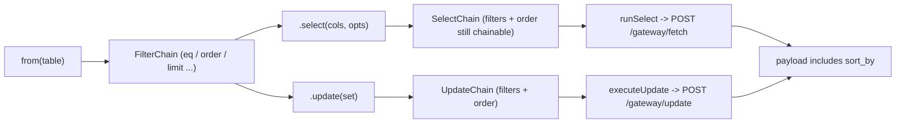

## Why

Currently `.order()` only exists on the RPC builder ([src/client.ts:201](src/client.ts)). The table chain `SelectChain` / `TableQueryBuilder` in [src/client.ts](src/client.ts) has no `.order()`, so this fails today:

```ts
await athena
  .from("rsf_messages")
  .eq("room_id", roomId)
  .select("*", { stripNulls: false })
  .order("created_at", { ascending: false })
  .limit(100);
```

The gateway already accepts the order via a `sort_by` object on `/gateway/fetch`:

```json
{ "table_name": "rsf_messages", "sort_by": { "field": "created_at", "direction": "descending" } }
```

## Chain shape (data flow)



## Changes

### 1) Types — [src/gateway/types.ts](src/gateway/types.ts)

Add `AthenaSortDirection` + `AthenaSortBy` and wire it into fetch/update/delete payloads:

```ts
export type AthenaSortDirection = 'ascending' | 'descending'

export interface AthenaSortBy {
  field: string
  direction: AthenaSortDirection
}

export interface AthenaFetchPayload {
  // ...existing fields
  sort_by?: AthenaSortBy
}

export interface AthenaDeletePayload {
  // ...existing fields
  sort_by?: AthenaSortBy
}
// AthenaUpdatePayload already extends AthenaFetchPayload, so it inherits sort_by.
```

### 2) Builder — [src/client.ts](src/client.ts)

- Extend `TableBuilderState` with `order?: AthenaSortBy`.
- Add `order(column, options?)` to the `FilterChain<Self>` interface (line 142) so it appears on `TableQueryBuilder`, `SelectChain`, and `UpdateChain`. Reuse/export the existing `RpcOrderOptions` as the `OrderOptions` shape (or alias). Signature:
  ```ts
  order(column: string, options?: { ascending?: boolean }): Self
  ```
- In `createFilterMethods` (around line 248), add:
  ```ts
  order(column: string, options?: { ascending?: boolean }) {
    state.order = {
      field: column,
      direction: options?.ascending === false ? 'descending' : 'ascending',
    }
    return self
  }
  ```
- In `runSelect` (line 532) include `sort_by: state.order` when set.
- In `executeUpdate` (line 682) include `sort_by: state.order` when set.
- In `executeDelete` (line 710) include `sort_by: state.order` when set.

### 3) Tests — extend [test/query-builder-behavior.test.ts](test/query-builder-behavior.test.ts) (and a user-facing case in [test/athena-builder.test.ts](test/athena-builder.test.ts))

New cases:
- `select + eq + order desc + limit` produces expected payload:
  ```js
  assert.deepEqual(payload.sort_by, { field: 'created_at', direction: 'descending' })
  assert.equal(payload.limit, 100)
  ```
- order with default ascending → `direction: 'ascending'`.
- order called before `.select()` (on the base `TableQueryBuilder`) still serializes.
- order called after `.select()` on `SelectChain` serializes (the user's target case).
- `update().eq(...).order(...)` sends `sort_by` on the update payload.
- Regression: existing tests without `.order()` still have `payload.sort_by === undefined`.

### 4) Docs

- [docs/api-reference.md](docs/api-reference.md): add `.order()` to `SelectChain` / `TableQueryBuilder` section and list the `AthenaSortBy` payload field.
- [docs/getting-started.md](docs/getting-started.md) (section "4. Filter" and a new "Sort" subsection) and [README.md](README.md) (filter list around line 236): add `.order()` example:
  ```ts
  await athena
    .from("rsf_messages")
    .eq("room_id", roomId)
    .select("*", { stripNulls: false })
    .order("created_at", { ascending: false })
    .limit(100);
  ```

## Non-goals

- No changes to RPC order behavior (already works).
- No gateway/server changes — the server already supports `sort_by`.
- No new public types exported beyond `AthenaSortBy` / `AthenaSortDirection`.