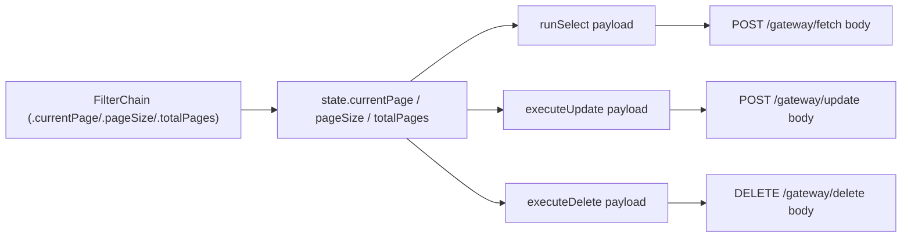

## Why

The gateway accepts these body fields:

```json
{ "limit": 25, "offset": 0, "current_page": 1, "page_size": 25, "total_pages": 10 }
```

`AthenaFetchPayload` already types them ([src/gateway/types.ts:61-63](src/gateway/types.ts)):

```ts
limit?: number
offset?: number
current_page?: number
page_size?: number
total_pages?: number
```

…but the builder only exposes `.limit()` / `.offset()` / `.range()`. This plan adds three more chainable methods so callers can send the remaining body fields.

## Design

Follow the exact pattern used for `.limit()` / `.offset()`:

- Extend `TableBuilderState` with three optional numeric fields.
- Add `currentPage(n)`, `pageSize(n)`, `totalPages(n)` to the `FilterChain<Self>` interface so they're available on `TableQueryBuilder`, `SelectChain`, and `UpdateChain` (same reach as existing pagination helpers).
- Include them in the fetch, update, and delete payloads (snake_case `current_page`, `page_size`, `total_pages`).
- Reset clears them.



## Changes

### 1) Builder — [src/client.ts](src/client.ts)

- Extend `TableBuilderState`:
  ```ts
  type TableBuilderState = {
    conditions: AthenaGatewayCondition[]
    limit?: number
    offset?: number
    order?: AthenaSortBy
    currentPage?: number
    pageSize?: number
    totalPages?: number
  }
  ```
- Extend `FilterChain<Self>` interface (the one that already declares `limit`/`offset`/`order`):
  ```ts
  currentPage(value: number): Self
  pageSize(value: number): Self
  totalPages(value: number): Self
  ```
- In `createFilterMethods`, add the setters:
  ```ts
  currentPage(value: number) { state.currentPage = value; return self },
  pageSize(value: number)    { state.pageSize    = value; return self },
  totalPages(value: number)  { state.totalPages  = value; return self },
  ```
- In `runSelect`, add to the payload:
  ```ts
  current_page: state.currentPage,
  page_size:    state.pageSize,
  total_pages:  state.totalPages,
  ```
- In `executeUpdate` and `executeDelete`, conditionally set the same three fields when defined (matching how `state.order` is conditionally attached).
- Update `reset()` to also clear `state.currentPage`, `state.pageSize`, `state.totalPages`.

No type changes are needed — `AthenaFetchPayload` already has them, and `AthenaUpdatePayload extends AthenaFetchPayload`. Only `AthenaDeletePayload` does not declare them, so we'll add the three optional numeric fields there for symmetry.

### 2) Tests — extend [test/query-builder-behavior.test.ts](test/query-builder-behavior.test.ts)

New cases (grouped with the existing pagination tests):
- `.currentPage(2).pageSize(25)` on a select serializes as `{ current_page: 2, page_size: 25 }`.
- `.totalPages(10)` serializes as `{ total_pages: 10 }`.
- Combination: `.currentPage(1).pageSize(50).totalPages(4).limit(50)` serializes all four.
- Order of calls doesn't matter (before/after `.select()` — same semantics as `.limit()`).
- Update chain: `update(...).eq(...).currentPage(2).pageSize(10).select()` sends both fields.
- Absence regression: a plain `.select('id')` has `current_page`, `page_size`, `total_pages` all `undefined`.
- `reset()` clears all three.

### 3) Docs

- [docs/api-reference.md](docs/api-reference.md) — add rows to the "Modifier methods" table:
  ```
  | `.currentPage(n)` | sets `current_page` on the request body |
  | `.pageSize(n)`    | sets `page_size` on the request body    |
  | `.totalPages(n)`  | sets `total_pages` on the request body  |
  ```
  And add `current_page? page_size? total_pages?` to the `AthenaDeletePayload` schema snippet.

- [docs/getting-started.md](docs/getting-started.md) — extend the "5. Paginate results" section with a page-based example:
  ```ts
  const { data } = await athena
    .from("orders")
    .select("id, total")
    .currentPage(2)
    .pageSize(25);
  ```

- [README.md](README.md) — add a short snippet in the existing "Pagination" section showing the new helpers.

## Non-goals

- No changes to `AthenaFetchPayload` / `AthenaUpdatePayload` (fields already declared).
- No new convenience methods like `.page(current, size)` — three explicit setters match the existing `.limit()`/`.offset()` style.
- No RPC changes (RPC has its own separate pagination path and isn't mentioned in the request).