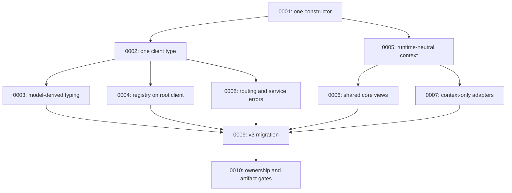

# Athena JS v3 Client API Consolidation Report

**Date:** 2026-07-15

**Status:** Accepted contract and implemented release candidate. The `3.0.0` facade now owns one immutable internal transport core; `withContext(...)` creates lightweight views and no longer delegates to or reconstructs the legacy client/type lattice.

**Package inspected:** `@xylex-group/athena` `2.16.0`

**Scope:** Replace the current constructor, capability, strictness, typed-client, and framework-adapter matrix with one public `createClient(...)` constructor and one public `AthenaClient<TModels>` contract that works in browser, Node.js, Edge, and request-scoped server environments.

**Implementation closure:** The builder, typed-client constructor, public auth constructor, capability client identities, strictness branches, `withSession`, `withOptions`, and client-level experimental storage/typecheck flags have been removed from source and emitted declarations. DB, auth, chat, storage, and raw HTTP operations resolve request context at dispatch over shared immutable transports. Publication state and remaining gates are tracked in [the release-readiness report](./client-v3-release-readiness-report.md).

## Post-release addendum (ADR 0014)

The original consolidation forbade Next construction entrypoints to eliminate **duplicate materializers** (builder, typed client, cached framework wrappers). [ADR 0014](./adr/0014-next-client-construction-facades.md) restores thin façades that always call `createClient`, with no request-bound caching and no second transport core:

| Entrypoint | Role |
| --- | --- |
| `createAthenaBrowserClient` | Browser-safe config typing → `createClient` |
| `createAthenaServerClient` | Async Next request/session resolution → `createClient` |

Historical sections below that say browser/server constructors are “gone” or “removed forever” describe the **pre-0014** hard cut, not the current public surface. The durable rule remains: only `createClient` implements client materialization.

JS SDK package version is `@xylex-group/athena@3.0.0`. athena-rs / monorepo OpenAPI is independently versioned at 4.x.

## Version-pinned construction baseline

This report and its ADR contracts use the following manifest-derived baseline:

- `@xylex-group/athena@2.16.0` - historical inspected implementation baseline for the consolidation design.
- `@xylex-group/athena@3.0.0` - current JS SDK package version for the consolidated API (plus ADR 0014 façades).
- athena-rs / monorepo OpenAPI - independently versioned HTTP contract line (4.x).
- Node.js `>=18.0.0` - current declared SDK engine range.

The `2.16.0` pin is the inspected implementation baseline for this report’s original analysis. The `3.0.0` pin is the JS SDK package that owns the consolidated surface.

## ADR contract set

The normative accepted decisions are indexed in [the client v3 ADR catalog](./adr/README.md). This report explains the design and records implementation evidence.

| ADR | Accepted contract | Primary effect | Status |
| --- | --- | --- | --- |
| [0001](./adr/0001-single-create-client-constructor.md) | `createClient(config)` is the only primitive materializer | Deletes builder, static, and typed alternate materializers | Superseded in part by 0014 (façades allowed) |
| [0002](./adr/0002-single-athena-client-type-and-stable-namespaces.md) | One `AthenaClient<TModels>` type owns stable service namespaces | Deletes `AthenaSdkClient*` and capability return types | Accepted |
| [0003](./adr/0003-model-derived-query-typing.md) | Query safety derives from known models and explicit row types | Deletes `TStrict` and `typecheckColumns` | Accepted |
| [0004](./adr/0004-root-client-owns-typed-registry-behavior.md) | Registry behavior belongs to normal `createClient({ models })` | Deletes `createTypedClient` and `TypedAthenaClient` | Accepted |
| [0005](./adr/0005-runtime-neutral-client-and-request-context.md) | One synchronous constructor works across runtimes; context resolves per operation | Prevents browser/server constructor drift and request leakage | Accepted |
| [0006](./adr/0006-immutable-client-core-and-context-views.md) | Context views share one immutable core | Prevents recursive reconstruction and transport duplication | Accepted |
| [0007](./adr/0007-framework-adapters-resolve-context-only.md) | Framework adapters resolve context; may compose façades over `createClient` | Keeps Next.js concerns out of core identity; no request-bound cache | Superseded in part by 0014 |
| [0008](./adr/0008-configuration-routing-and-service-errors.md) | Routing precedence and unavailable-service failures are deterministic | Makes stable namespaces operationally honest | Accepted |
| [0009](./adr/0009-v3-breaking-migration-and-version-contract.md) | The cleanup ships as an explicit v3 contract | Prevents compatibility aliases from becoming permanent architecture | Accepted |
| [0010](./adr/0010-client-module-ownership-and-artifact-governance.md) | Source ownership and generated artifacts are release gates | Prevents the type lattice from returning through drift | Accepted |
| [0014](./adr/0014-next-client-construction-facades.md) | Thin Next façades may call `createClient` | Restores discoverable Next construction without a second core | Accepted |

The dependency direction is intentional:



ADR 0001 and ADR 0002 are the governing API decisions. ADRs 0003 through 0008 make that API technically coherent. ADR 0009 governs the breaking release. ADR 0010 prevents future implementation and documentation drift.

## Executive decision

Athena JS should have one client constructor:

```ts
const athena = createClient(config)
```

It should return one client type:

```ts
AthenaClient<TModels>
```

The following public concepts should be removed from the final v3 API:

- `AthenaClient` as a static factory class
- `AthenaClient.builder()`
- `AthenaClient.fromEnvironment()`
- `AthenaClientBuilder`
- `createTypedClient()`
- `TypedAthenaClient`
- `AthenaSdkClient`
- `AthenaSdkClientWithAuth`
- `AthenaSdkClientWithStorage`
- storage-enabled client return types
- strict-column-enabled client return types
- all `WithStorage`, `WithTypecheckedColumns`, and combined configuration interfaces
- `createAthenaBrowserClient()`
- `createAthenaServerClient()`
- `withOptions()` as a disguised second constructor

Storage, auth, chat, DB, RPC, raw requests, and connection verification should be stable namespaces on every Athena client. Model awareness should be the only meaningful client generic. Request identity should be runtime context, not part of the nominal client type.

This is a major-version change. The clean target is more valuable than preserving the current type lattice indefinitely.

## Why the current design became unmanageable

The SDK accumulated features additively:

1. `createClient(url, key, options)` existed first.
2. `AthenaClient.builder()` added a second configuration syntax.
3. `AthenaClient.fromEnvironment()` added a third configuration syntax.
4. Auth and chat were added to a derived client interface.
5. Storage was placed behind an experimental flag and represented by another derived interface.
6. Strict column checking was represented by a boolean client generic.
7. Typed registries gained a second client implementation and constructor.
8. Next browser and server adapters gained their own constructors and overload matrices.
9. Context helpers rebuilt the full client to preserve those return-type variants.

Each individual addition was understandable. Together they produced a public API where consumers must know construction history to identify the resulting object.

That is backwards. A consumer should know that the value is an Athena client. Runtime configuration determines which endpoints succeed; it should not create a new nominal species of client.

## Current evidence

### Public type proliferation

The live package contains these primary client identities:

```text
AthenaSdkClient<TStrict, TModels>
  AthenaSdkClientWithAuth<TStrict, TModels>
    AthenaSdkClientWithStorage<TStrict, TModels>

TypedAthenaClient<TRegistry, TTenantMap, TStrict>
```

The capability hierarchy is misleading:

- `createClient()` already returns the auth-capable client by default.
- Chat is attached to `AthenaSdkClientWithAuth`, even though chat is not an auth capability.
- `AthenaSdkClient` is therefore not the normal client returned by the normal constructor.
- Storage is treated as a different client identity solely because its namespace is conditionally attached.
- `TStrict` is controlled by a type-only experimental flag and is threaded through query builders, RPC builders, DB modules, adapters, and client types.

Current source and documentation references include:

| Symbol | References | Files |
| --- | ---: | ---: |
| `AthenaSdkClient` | 37 | 11 |
| `AthenaSdkClientWithAuth` | 67 | 11 |
| `AthenaSdkClientWithStorage` | 52 | 8 |
| `AthenaClientBuilder` | 84 | 5 |

The configuration matrix adds at least these public interfaces:

- `AthenaCreateClientOptions`
- `AthenaCreateClientOptionsWithStorage`
- `AthenaCreateClientOptionsWithTypecheckedColumns`
- `AthenaCreateClientOptionsWithStorageAndTypecheckedColumns`
- `AthenaCreateClientConfig`
- `AthenaCreateClientConfigWithStorage`
- `AthenaCreateClientConfigWithTypecheckedColumns`
- `AthenaCreateClientConfigWithStorageAndTypecheckedColumns`
- `AthenaClientFromEnvironmentOptions`
- `AthenaClientFromEnvironmentOptionsWithStorage`
- `AthenaClientFromEnvironmentOptionsWithTypecheckedColumns`
- `AthenaClientFromEnvironmentOptionsWithStorageAndTypecheckedColumns`

Next adapters repeat the same combinations with browser and server option interfaces and overloads. `createTypedClient()` repeats strictness overloads again.

### Runtime duplication

The runtime already has one real construction implementation:

```text
createClient(...)
  -> createClientFromInput(...)
    -> resolveCreateClientConfig(...)
      -> createClientFromConfig(...)
```

The other constructors eventually feed that pipeline:

```text
AthenaClient.builder().build()
  -> createClientFromInput(...)

AthenaClient.fromEnvironment()
  -> createClient(...)

createAthenaBrowserClient()
  -> createAdapterClient(...)
    -> AthenaClient.fromEnvironment(...)

createAthenaServerClient()
  -> createAdapterClient(...)
    -> AthenaClient.fromEnvironment(...)
```

These are not independent implementations. They are alternate entrances that multiply types, tests, docs, and naming.

### Full reconstruction on context changes

In `src/client.ts`, all three context/override helpers re-enter the full constructor:

- `withContext()` calls `createClientFromInput(...)`.
- `withSession()` calls `createClientFromInput(...)`.
- `withOptions()` calls `createClientFromInput(...)`.

This reconstructs:

- gateway transport
- result formatter
- query tracer
- auth bindings
- chat module
- DB facade
- raw request facade
- optional storage module

Storage-enabled clients duplicate those closures again solely to preserve `AthenaSdkClientWithStorage` as the return type.

### Typed client duplication

`src/schema/typed-client.ts` is a second client implementation around the first client. It duplicates:

- construction
- session-to-context resolution
- header merging
- auth merging
- tenant-context propagation
- `from`, RPC, query, request, and connection forwarding
- context cloning
- strictness overloads

It also contains casts back to `AthenaSdkClient<TStrict>` and constructs new `TypedAthenaClientImpl` objects for context changes.

This is no longer necessary because root `createClient({ models })` already supports model-aware table-name inference and `from(modelValue)` already supports generated model values.

### File size is hiding the architecture

At the `2.16.0` baseline, `src/client.ts` was 3,575 lines and `src/client-builder.ts` added another 283 lines. The builder file is now removed. The 3.0 implementation moved public construction/config/context into `v3-client.ts` and extracted result/error handling, SQL/debug compilation, and raw request dispatch into `client-result.ts`, `client-sql.ts`, and `client-request.ts`. `client.ts` is now below 2,000 lines and is primarily fluent builder orchestration plus internal namespace assembly.

The remaining size is still an architectural signal, not merely an aesthetic concern. Future extraction should target cohesive builder-state reducers or mutation execution planning without creating circular helper barrels. See the [client internal architecture guide](./client-internal-architecture.md).

## Design principles for v3

### 1. One constructor means one constructor

Only `createClient(config)` may materialize an Athena client core.

Framework integrations may resolve configuration or request context, but they must not expose another client constructor.

### 2. Capabilities are namespaces, not client identities

The existence of `client.storage`, `client.auth`, or `client.chat` should not change the type name.

Every client exposes:

```ts
client.db
client.auth
client.chat
client.storage
client.from(...)
client.rpc(...)
client.query(...)
client.request(...)
client.verifyConnection(...)
```

If a service URL is unavailable, calling that namespace produces a structured configuration error for that service. The property itself does not disappear.

### 3. Type behavior must derive from known data, not runtime flags

`experimental.typecheckColumns` is explicitly documented as type-only. A runtime options object should not control whether TypeScript checks a column name.

Instead:

- known model or row shape -> typed columns
- unknown model or row shape -> permissive strings
- explicit unsafe escape hatch -> caller opts out at the callsite

There should be no `TStrict extends boolean` generic on the client or builders.

### 4. Request identity is context

User ID, organization ID, cookie, bearer token, session token, and no-cache behavior belong to a request context.

They do not define a new client capability or client type.

### 5. Browser/server compatibility is a runtime boundary, not an API fork

Both root and browser conditional bundles export the same `createClient` signature and the same `AthenaClient<TModels>` type.

The package export map selects browser-safe implementation dependencies. Consumers do not select a different constructor.

### 6. One generic is enough

The normal client needs at most one public generic: the model map or registry used for inference.

Avoid exposing booleans and capability states through client generics.

## Proposed public API

### Canonical construction

Use an object-only constructor:

```ts
import { createClient } from '@xylex-group/athena'
import { registry } from './athena/registry.generated'

const athena = createClient({
  url: process.env.NEXT_PUBLIC_ATHENA_URL,
  key: process.env.NEXT_PUBLIC_ATHENA_API_KEY,
  client: 'formations-web',
  models: registry,
})
```

The positional overload should be removed in v3:

```ts
// Remove in v3
createClient(url, key, options)
```

Object-only construction gives the API one extensible contract and eliminates positional overload inference.

### Proposed types

```ts
export type MaybePromise<T> = T | Promise<T>

export interface AthenaRequestContext {
  userId?: string | null
  organizationId?: string | null
  headers?: Record<string, string>
  cookie?: string | null
  bearerToken?: string | null
  sessionToken?: string | null
  forceNoCache?: boolean
}

export type AthenaRequestContextProvider =
  () => MaybePromise<AthenaRequestContext | undefined>

export interface AthenaClientConfig<
  TModels extends AthenaClientModelsInput | undefined = undefined,
> {
  url?: string | null
  key?: string | null
  client?: string | null
  backend?: BackendConfig | BackendType
  headers?: Record<string, string>
  models?: TModels

  db?: AthenaServiceConfig
  auth?: AthenaAuthConfig
  chat?: AthenaChatConfig
  storage?: AthenaStorageConfig

  env?: Record<string, string | undefined>
  context?: AthenaRequestContext | AthenaRequestContextProvider

  retry?: AthenaRetryOptions
  diagnostics?: AthenaDiagnosticsOptions
}

export interface AthenaClient<
  TModels extends AthenaClientModelsInput | undefined = undefined,
> {
  readonly db: AthenaDbModule<TModels>
  readonly auth: AthenaAuthBindings
  readonly chat: AthenaChatModule
  readonly storage: AthenaStorageModule

  from: AthenaFromMethod<TModels>
  rpc: AthenaRpcMethod
  query: AthenaQueryMethod
  request: AthenaRequestMethod
  verifyConnection: AthenaVerifyConnectionMethod

  withContext(context: AthenaRequestContext): AthenaClient<TModels>
}

export function createClient<
  const TModels extends AthenaClientModelsInput | undefined = undefined,
>(config: AthenaClientConfig<TModels>): AthenaClient<TModels>
```

This is the entire construction/type identity story.

### Why `AthenaClient<TModels>` is sufficient

Auth and chat are already present on the normal `createClient()` result. Storage can be made stable. Strictness can derive from known row types. Therefore the current inheritance chain contains no durable domain distinction.

The only useful distinction is whether the client knows model metadata:

```ts
const untyped = createClient({ url, key })
// AthenaClient<undefined>

const typed = createClient({ url, key, models: registry })
// AthenaClient<typeof registry>
```

Both are the same runtime client and the same public interface family.

## Remove the storage capability type

### Current problem

Storage is attached only when:

```ts
experimental: {
  athenaStorageBackend: true,
}
```

That conditional property forces:

- `AthenaSdkClientWithStorage`
- storage-aware create options
- storage-aware config types
- storage-aware builder states
- storage-aware browser adapter overloads
- storage-aware server adapter overloads
- storage-aware resolved-context overloads
- casts inside context methods

### Recommended change

Graduate storage from an experimental capability. Always attach `client.storage`.

Resolve the storage URL from:

1. `config.storage.url`
2. `config.storageUrl` during migration only
3. the unified root URL plus `/storage`

If none is available, storage methods should return or throw a structured Athena storage configuration error:

```ts
{
  code: 'STORAGE_NOT_CONFIGURED',
  service: 'storage',
  message: 'Athena storage is not configured.',
}
```

Do not remove the `.storage` property from the object.

Move storage-specific tuning out of the global experimental capability gate:

```ts
createClient({
  storage: {
    url: 'https://athena.example.com/storage',
    directUpload: {
      bucket: 'files',
    },
  },
})
```

Delete:

- `experimental.athenaStorageBackend`
- `AthenaCreateClientOptionsWithStorage`
- `AthenaCreateClientConfigWithStorage`
- every combined storage/strictness interface
- `AthenaSdkClientWithStorage`

## Remove strictness from the client identity

### Current problem

`experimental.typecheckColumns` is type-only, but it introduces `TStrict` throughout:

- `AthenaSdkClient<TStrict, TModels>`
- `TableQueryBuilder<..., TStrict>`
- `RpcQueryBuilder<..., TStrict>`
- `AthenaDbModule<TStrict, TModels>`
- builder state generics
- create-client conditional types
- Next adapter overloads
- typed-client overloads

This creates a large public type-state machine without changing runtime behavior.

### Recommended change

Always validate columns when TypeScript knows the row shape.

Conceptually:

```ts
type ColumnName<Row> =
  unknown extends Row
    ? string
    : Extract<keyof Row, string>
```

The real implementation will need the existing selection/alias grammar, but the governing rule stays simple:

- `from(userModel)` knows the row -> typed columns
- `from('users')` with a model registry knows the row -> typed columns
- `from<User>('users')` knows the row -> typed columns
- `from('dynamic_table')` without a row type -> strings allowed

Provide a local escape hatch for dynamic SQL-like cases rather than weakening the entire client:

```ts
athena.from(userModel).select(unsafeColumns(runtimeSelection))
```

or a clearly named query option:

```ts
athena.from(userModel).select(runtimeSelection, {
  validateColumns: false,
})
```

Delete:

- `experimental.typecheckColumns`
- `TStrict` from client types
- `TStrict` from query/RPC/DB builder types where it only represents this flag
- `AthenaCreateClientOptionsWithTypecheckedColumns`
- `AthenaCreateClientConfigWithTypecheckedColumns`
- all combined storage/strictness types

## Fold typed clients into `createClient`

### Current problem

The package supports both:

```ts
createClient({ models: registry })
```

and:

```ts
createTypedClient(registry, url, key, options)
```

The second form produces `TypedAthenaClient`, has its own implementation class, repeats context behavior, and adds tenant-specific state.

### Recommended change

Delete `createTypedClient`, `TypedAthenaClient`, `TypedClientOptions`, and `TypedClientOptionsWithTypecheckedColumns` in v3.

Use:

```ts
const athena = createClient({
  url,
  key,
  models: registry,
})
```

Prefer model-value access:

```ts
athena.from(registry.app.schemas.public.models.users)
```

If `fromModel(database, schema, model)` remains valuable, add it directly to `AthenaClient<TModels>` when `TModels` is a compatible registry. Do not create a second client class for it.

Tenant header mapping should become request-context configuration:

```ts
const athena = createClient({
  url,
  key,
  models: registry,
  context: async () => ({
    headers: mapTenantHeaders(await currentTenant()),
  }),
})
```

The tenant mapper may remain an exported utility if it has broad value. It should not define another client identity.

Delete `src/schema/typed-client.ts` once its remaining registry navigation helpers have been moved into the core model resolution seam.

## Remove the builder and static class

### Current problem

The builder is a mutable way to assemble the same object accepted by `createClient`. It provides no runtime capability unavailable to the object form.

It costs:

- 283 implementation lines in `src/client-builder.ts`
- `AthenaClientBuilder<StorageEnabled, TStrict>`
- overloads for experimental state transitions
- merge semantics that differ from object construction
- builder-only tests
- builder-only documentation
- browser export obligations
- generated method-reference entries

### Recommended change

Delete:

- `src/client-builder.ts`
- `AthenaClientBuilder`
- the `AthenaClient` class
- `AthenaClient.builder()`

Translate builder usage mechanically:

```ts
const athena = AthenaClient.builder()
  .url(url)
  .key(key)
  .backend(Backend.Athena)
  .client('dashboard')
  .headers({ 'X-Region': 'eu' })
  .auth({ baseUrl: authUrl })
  .experimental({ traceQueries: true })
  .build()
```

becomes:

```ts
const athena = createClient({
  url,
  key,
  backend: Backend.Athena,
  client: 'dashboard',
  headers: { 'X-Region': 'eu' },
  auth: { url: authUrl },
  diagnostics: { traceQueries: true },
})
```

The object form is shorter, immutable, serializable, testable, and easier to infer.

## Fold environment construction into `createClient`

### Current problem

`AthenaClient.fromEnvironment()` is another constructor with four overloads solely to preserve storage and strictness return types.

### Recommended change

Allow `createClient` to resolve environment aliases:

```ts
const athena = createClient({
  env: process.env,
})
```

Resolution precedence should be explicit:

1. direct config field
2. service-specific direct config
3. supplied `env` aliases
4. no implicit global environment read unless intentionally documented

Requiring `env: process.env` is clearer and safer than silently reading global state. Browser applications can pass their framework-injected public environment object.

Delete all `AthenaClientFromEnvironmentOptions*` types.

## Browser and server behavior

### Keep the conditional root export

The package already maps the root import to `dist/browser.js` under the browser export condition and to `dist/index.js` otherwise.

Keep this behavior. Both bundles must export the same public constructor and type contract:

```ts
import { createClient } from '@xylex-group/athena'
```

The switch is implementation selection, not API selection.

The root export contract can retain the current conditional shape:

```json
{
  "exports": {
    ".": {
      "browser": {
        "types": "./dist/browser.d.ts",
        "import": "./dist/browser.js",
        "require": "./dist/browser.cjs",
        "default": "./dist/browser.js"
      },
      "types": "./dist/index.d.ts",
      "import": "./dist/index.js",
      "require": "./dist/index.cjs",
      "default": "./dist/index.js"
    }
  }
}
```

This is the automatic switch the SDK needs. Bundlers that include the `browser` condition resolve the browser implementation; Node.js and server tooling resolve the default implementation. Consumers do not select `createBrowserClient` or `createServerClient`, and ordinary application code does not need `typeof window` branching.

The explicit `@xylex-group/athena/browser` subpath may remain for unusual bundlers and direct verification, but it must be documented as an implementation-selection escape hatch, not a second client API. Its declarations must be generated from the same public contract as the root entry.

### Do not return `Client | Promise<Client>`

`createClient` should stay synchronous. Making it async only on the server would produce an unusable runtime-dependent return type.

Server request context can be asynchronous because Athena operations already return promises. Resolve context immediately before each request, not during construction.

### Add a lazy request-context provider

```ts
const athena = createClient({
  url,
  key,
  context: async () => {
    const request = await resolveCurrentRequest()

    return {
      cookie: request.headers.get('cookie'),
      bearerToken: readBearerToken(request.headers),
      userId: request.user?.id,
      organizationId: request.organization?.id,
    }
  },
})
```

The provider must run per operation. It must never be resolved once and cached on a process-wide client.

### Replace Next constructors with context helpers

Remove:

- `createAthenaBrowserClient()`
- `createAthenaServerClient()`

Keep the Next subpaths for framework integration, but export context/bridge helpers rather than constructors:

```ts
import { createClient } from '@xylex-group/athena'
import { resolveNextRequestContext } from '@xylex-group/athena/next/server'

const athena = createClient({
  env: process.env,
  context: resolveNextRequestContext,
})
```

Browser code uses the same constructor:

```ts
import { createClient } from '@xylex-group/athena'

export const athena = createClient({
  url: process.env.NEXT_PUBLIC_ATHENA_URL,
  key: process.env.NEXT_PUBLIC_ATHENA_API_KEY,
  auth: {
    credentials: 'include',
  },
})
```

`resolveAthenaServerContext()` should stop constructing a client. Rename or split it into a helper that returns:

```ts
interface AthenaResolvedServerContext {
  request: AthenaRequestContext
  session: AthenaAuthSessionResponse | null
  userId: string | null
  organizationId: string | null
}
```

The application can pass `request` to `athena.withContext(...)` or use the lazy provider directly.

## Client core and context views

### Separate immutable core from request context

Create an internal `AthenaClientCore<TModels>` that owns stable resources:

- resolved service URLs
- API key and backend routing
- model registry
- gateway transport
- auth transport
- chat transport
- storage transport
- retry policy
- diagnostics/tracing

Create a lightweight client view containing:

- a reference to the shared core
- a static context and/or context provider

Conceptually:

```ts
interface AthenaClientView<TModels> {
  core: AthenaClientCore<TModels>
  resolveContext: AthenaRequestContextProvider
}
```

Every service request combines:

```text
core headers
  + resolved request context
  + operation headers
```

with operation headers taking final precedence.

### Keep at most one context-view method

Retain:

```ts
athena.withContext(context)
```

It returns the same `AthenaClient<TModels>` type and shares the same core.

Remove:

- `withOptions()` because endpoint/key retargeting is client construction
- `withSession()` from the core client if session-to-context conversion can live in an exported utility

If `withSession()` remains for ergonomics, it must:

- return `AthenaClient<TModels>`
- share the existing core
- only convert session data into request context
- never call `createClient()` internally

## Proposed internal module layout

Replace the 3,575-line `src/client.ts` with focused modules:

```text
src/client/
  create-client.ts
  public-types.ts
  config.ts
  environment.ts
  service-urls.ts
  context.ts
  core.ts
  view.ts
  request.ts
```

Suggested ownership:

### `create-client.ts`

- public `createClient(config)` implementation
- generic inference boundary
- no query-builder implementation

### `public-types.ts`

- `AthenaClient`
- `AthenaClientConfig`
- `AthenaRequestContext`
- `AthenaRequestContextProvider`
- method contracts

### `config.ts`

- normalize direct fields
- merge service overrides
- validate key and at least one routable endpoint
- produce `ResolvedAthenaClientConfig`

### `environment.ts`

- known env aliases
- explicit `env` resolution
- no client construction

### `context.ts`

- static/provider context resolution
- session-to-context utility
- header precedence
- cookie/bearer/session-token normalization

### `core.ts`

- stable transports and namespace factories
- no request identity

### `view.ts`

- assemble the public client object
- lightweight context views sharing core

### Existing domain modules

Keep query, DB, auth, chat, and storage behavior in their existing domain modules. Do not move everything into the new client folder.

## Type cleanup inventory

### Delete in v3

| Current symbol | Replacement |
| --- | --- |
| `AthenaSdkClient` | `AthenaClient<TModels>` |
| `AthenaSdkClientWithAuth` | `AthenaClient<TModels>` |
| `AthenaSdkClientWithStorage` | `AthenaClient<TModels>` |
| `AthenaClient` class | removed; name reused for interface |
| `AthenaClientBuilder` | removed |
| `AthenaClientConfig` builder AST | internal `ResolvedAthenaClientConfig` |
| `AthenaClientFromEnvironmentOptions*` | `AthenaClientConfig.env` |
| `AthenaCreateClientOptions` | folded into `AthenaClientConfig` |
| `AthenaCreateClientOptionsWithStorage` | removed |
| `AthenaCreateClientOptionsWithTypecheckedColumns` | removed |
| `AthenaCreateClientOptionsWithStorageAndTypecheckedColumns` | removed |
| `AthenaCreateClientConfig` | renamed `AthenaClientConfig` |
| `AthenaCreateClientConfigWithStorage` | removed |
| `AthenaCreateClientConfigWithTypecheckedColumns` | removed |
| `AthenaCreateClientConfigWithStorageAndTypecheckedColumns` | removed |
| `AthenaClientOverrideOptions` | removed with `withOptions()` |
| `TypedAthenaClient` | `AthenaClient<TModels>` |
| `TypedClientOptions*` | `AthenaClientConfig<TModels>` |
| `AthenaAdapterClient` | `AthenaClient<TModels>` |
| browser/server storage/strict option variants | base adapter/context options |

### Keep, but simplify or rename

| Current concept | v3 direction |
| --- | --- |
| `AthenaClientModelsInput` | Keep as the accepted model/registry constraint |
| `AthenaClientContextOptions` | Rename `AthenaRequestContext` |
| `AthenaClientSessionLike` | Keep only if session conversion stays public |
| `AthenaCreateClientAuthOptions` | Rename `AthenaAuthConfig` |
| `AthenaCreateClientChatOptions` | Rename `AthenaChatConfig` |
| service URL config | Rename `AthenaServiceConfig` |
| `AthenaResult<T>` | Keep |
| query/mutation/RPC builders | Keep, remove `TStrict` where possible |
| model/row/insert/update utility types | Keep |

## Experimental option cleanup

The current experimental object mixes unrelated concerns:

- deprecated error normalization compatibility
- read retries
- query tracing
- debug ASTs
- type-only column checking
- alternate `findMany` transport
- storage capability exposure
- direct storage upload configuration
- storage hooks

Recommended v3 grouping:

```ts
createClient({
  retry: {
    reads: true,
  },
  diagnostics: {
    traceQueries: true,
    debugAst: true,
  },
  storage: {
    directUpload: { /* ... */ },
    hooks: { /* ... */ },
  },
  compatibility: {
    findManyAst: true,
  },
})
```

Remove no-op `enableErrorNormalization` in v3. Remove `typecheckColumns` entirely. Remove `athenaStorageBackend` entirely.

Only genuinely unstable runtime behavior should remain under `experimental` or `compatibility`.

## Error behavior

One always-present client requires predictable configuration errors.

Add a structured error contract:

```ts
export type AthenaService = 'db' | 'auth' | 'chat' | 'storage'

export class AthenaConfigurationError extends Error {
  readonly code = 'ATHENA_SERVICE_NOT_CONFIGURED'
  readonly service: AthenaService
}
```

Service namespace calls should fail at invocation time when their endpoint is unavailable. Core construction should still fail immediately for a missing API key or when no service can be routed at all.

This produces a stable object shape without hiding misconfiguration.

## Migration strategy

### Accepted direct stable hard cut

No final 2.x bridge, beta release, or compatibility declaration layer is published. Local `3.0.0` package tarballs are installed into controlled consumers before the irreversible registry operation.

The v3 major release removes:

Remove:

- deprecated symbols
- positional `createClient` overload
- builder implementation
- typed-client implementation
- Next client constructors
- conditional storage/strictness overloads
- deprecated experimental flags
- compatibility docs

The v3 declarations should visibly contain one client interface and one client constructor.

The release order is Athena `3.0.0`, Better Auth Athena `2.0.0`, Auth UI `2.0.0`, then Speedrun lockfile migration.

## Consumer migration examples

### Builder

```ts
// Before
const athena = AthenaClient.builder()
  .url(url)
  .key(key)
  .experimental({ athenaStorageBackend: true })
  .build()

// After
const athena = createClient({ url, key })
```

### Environment

```ts
// Before
const athena = AthenaClient.fromEnvironment({
  experimental: { typecheckColumns: true },
})

// After
const athena = createClient({
  env: process.env,
})
```

### Storage type

```ts
// Before
function upload(client: AthenaSdkClientWithStorage) {
  return client.storage.file.upload(...)
}

// After
function upload(client: AthenaClient) {
  return client.storage.file.upload(...)
}
```

### Typed registry

```ts
// Before
const athena = createTypedClient(registry, url, key)

// After
const athena = createClient({
  url,
  key,
  models: registry,
})
```

### Next server

```ts
// Before
const athena = await createAthenaServerClient({
  url,
  key,
})

// After: long-lived client with per-request context
const athena = createClient({
  url,
  key,
  context: resolveNextRequestContext,
})
```

### Explicit request view

```ts
const requestContext = await resolveNextRequestContext()
const requestAthena = athena.withContext(requestContext)
```

The view keeps the same `AthenaClient<TModels>` type and shares the original core.

## Public surface delta manifest

The migration should be reviewed as a deliberate public-surface replacement, not as a sequence of incidental renames.

| Current v2 surface | v3 disposition | v3 replacement |
| --- | --- | --- |
| `createClient(url, apiKey, options?)` | Remove positional overload | `createClient({ url, key, ...options })` |
| `AthenaClient.builder()` | Remove | `createClient(config)` |
| `AthenaClient.fromEnvironment()` | Remove | `createClient({ env })` |
| `createTypedClient(registry, ...)` | Remove | `createClient({ models: registry, ... })` |
| `createAthenaBrowserClient()` | Restored as thin façade (ADR 0014) | `@xylex-group/athena/next/client` → `createClient` |
| `createAthenaServerClient()` | Restored as thin façade (ADR 0014) | `@xylex-group/athena/next/server` → resolve context + `createClient` |
| `AthenaSdkClient` | Remove | `AthenaClient<TModels>` |
| `AthenaSdkClientWithAuth` | Remove | `AthenaClient<TModels>` |
| `AthenaSdkClientWithStorage` | Remove | `AthenaClient<TModels>` |
| `TypedAthenaClient` | Remove | `AthenaClient<TModels>` |
| `AthenaClientBuilder<StorageEnabled, TStrict>` | Remove | no replacement type |
| `experimental.athenaStorageBackend` | Remove | `client.storage` always exists |
| `experimental.typecheckColumns` | Remove | inference from `models` or explicit row type |
| `withOptions()` | Remove | construct a distinct client explicitly |
| `withContext()` | Keep, narrow responsibility | lightweight view sharing the same core |
| `withSession()` | Move or strictly constrain | context conversion utility or lightweight view |
| Next.js server/client subpaths | Keep only for integration | context resolvers, session bridge, cookie helpers |

Names unrelated to the data-client constructor remain outside this consolidation. For example, `createAthenaQueryClient` is a TanStack Query integration and `createAthenaAuthClient` belongs to the auth UI package; neither is an alternate construction path for the Athena data client. Documentation must make that ownership clear so "one `createClient`" is not misread as "the ecosystem may contain no other factory function."

## Runtime contract matrix

The public import and return type remain identical in every supported runtime. Only configuration sources and context resolution differ.

| Runtime | Import | Construction | Context source | Required invariant |
| --- | --- | --- | --- | --- |
| Browser | `@xylex-group/athena` | synchronous | static auth options, cookies, or caller-provided context | no Node-only module in the browser graph |
| Node.js process | `@xylex-group/athena` | synchronous | static config or async provider | provider runs for each operation |
| Next.js client component | `@xylex-group/athena` | synchronous | browser credentials/cookies | no framework client constructor or singleton cache |
| Next.js server request | `@xylex-group/athena` | synchronous | `resolveNextRequestContext` provider | request identity is never captured globally |
| Edge/Worker | `@xylex-group/athena` | synchronous | request-derived provider | no dependency on `process`, filesystem, or Node globals |
| Tests/CLI | `@xylex-group/athena` | synchronous | explicit config/context | no ambient environment dependency unless `env` is passed |

Conditional package exports may select different internal entry modules, but every entry must export a structurally equivalent `createClient` and the same `AthenaClient<TModels>` declaration. A browser build must not solve compatibility by exposing a smaller public client type.

## Request context and header precedence contract

The most important server-side safety property is that identity is late-bound. Client construction may be process-scoped; user, session, organization, cookie, and bearer data may not be.

For every operation, the transport should resolve and merge request data in this order:

1. core defaults derived from `createClient(config)`
2. static client context, if supplied
3. lazy context-provider result for the current operation
4. `withContext(...)` view context
5. operation-specific headers and options

Later layers win, except protected SDK headers whose override policy is explicitly documented. `undefined` must mean "no override" rather than silently deleting a lower-precedence value; explicit removal needs a distinct representation if it is supported.

The context contract should carry semantic fields rather than forcing adapters to prebuild implementation headers:

```ts
export interface AthenaRequestContext {
  bearerToken?: string | null
  cookie?: string | null
  sessionToken?: string | null
  userId?: string | null
  organizationId?: string | null
  noCache?: boolean
  headers?: Readonly<Record<string, string>>
}

export type AthenaRequestContextProvider =
  () => AthenaRequestContext | Promise<AthenaRequestContext>
```

The transport converts those fields to headers at the final request boundary. This yields one place to test precedence, redaction, and service parity. Auth, DB, RPC, chat, storage, and raw request paths must all use that same boundary.

For credential-bearing semantic fields, `null` explicitly clears an inherited value and `undefined` preserves ordinary resolution. This distinction must be covered by type fixtures and runtime tests; otherwise a context view cannot safely remove a process-level default.

## Service availability contract

Stable namespaces do not mean every deployment has every service configured. They mean object shape is stable and failure behavior is explicit.

| Condition | Construction result | Namespace call result |
| --- | --- | --- |
| Unified Athena root is configured | client succeeds | routes all supported services from the root contract |
| Service-specific URL overrides root | client succeeds | that namespace uses the explicit override |
| A service is unavailable but another route is usable | client succeeds | unavailable namespace throws `ATHENA_SERVICE_NOT_CONFIGURED` |
| No route is usable | construction fails | no client is returned |
| API key required but missing | construction fails | no deferred ambiguous authorization failure |
| Context provider fails | construction remains valid | current operation rejects with contextual cause |

The SDK must not hide a missing service by omitting its property, returning `undefined`, or changing the client type. It also must not eagerly probe every service during construction; creation should remain deterministic and side-effect free unless a separate verification operation is called.

## Controlled-consumer impact inventory

The repository already contains consumers that prove why a staged migration gate is required:

- `packages/athena-auth-ui/packages/heroui/src/athena/table-query-executor.ts` accepts `AthenaSdkClient | AthenaSdkClientWithAuth`.
- `packages/athena-auth-ui/examples/next-heroui-example/src/lib/athena.ts` stores `AthenaSdkClientWithAuth`.
- `packages/athena-auth-ui/examples/next-heroui-example/src/components/chat-showcase/use-chat-showcase.ts` casts through `unknown` to `AthenaSdkClientWithStorage`.
- browser-facing examples import `createClient` through `@xylex-group/athena/browser` and still use the positional overload.
- generated documentation under `apps/docs/content/docs/sdks/athena-js` reproduces builder, positional-constructor, strictness, typed-client, and capability-type contracts.
- `packages/athena-js/test/type-compatibility.ts`, builder tests, adapter tests, and the method-reference generator intentionally encode the current v2 surface.

These are migration targets, not reasons to retain the old model. The `unknown as AthenaSdkClientWithStorage` cast is especially useful evidence: the capability return type is already forcing consumers to lie to TypeScript about a runtime namespace the SDK controls.

The consumer gate should compile at least:

1. the SDK type-compatibility fixtures rewritten for v3
2. the auth UI HeroUI package
3. the Next HeroUI example
4. the docs generation workspace
5. one browser-bundle smoke consumer
6. one server request-context smoke consumer

## Risk register and mitigations

| Risk | Severity | Failure mode | Required mitigation |
| --- | --- | --- | --- |
| Request identity leaks across users | Critical | provider output or request client cached globally | per-operation provider tests with concurrent identities; prohibit request-bound singleton caches |
| Browser bundle imports server code | High | package fails in browser/Edge or grows unexpectedly | export-condition smoke tests and bundle inspection |
| Header behavior changes during centralization | High | auth/session/organization routes silently break | table-driven precedence tests for every service transport |
| Stable namespace masks missing configuration | High | late generic network errors | structured `ATHENA_SERVICE_NOT_CONFIGURED` with service name |
| Model inference regresses | High | query builders fall back to `any` | declaration fixtures for known, unknown, explicit, and empty model maps |
| Registry runtime behavior is lost | High | typed targets resolve incorrectly | port `fromModel` and tenant mapping tests before deleting `TypedAthenaClient` |
| Compatibility aliases become permanent | Medium | old type lattice survives in declarations | remove aliases in v3; declaration scan is a release gate |
| Generated docs resurrect removed APIs | Medium | users continue adopting dead surfaces | update generator inputs before regenerating; fail docs sync on stale names |
| Source split creates circular imports | Medium | build/runtime initialization failures | dependency direction tests and no barrel-driven internal architecture |
| Broad rename affects unrelated factories | Medium | auth UI or query integrations break unnecessarily | scope deletion to Athena data-client constructors and types |

## Decision and acceptance status

ADRs 0001-0013 were accepted by Floris on 2026-07-15. The accepted amendments remove `createAuthClient`, `withSession`, flat URL aliases, and `typecheckColumns`; select a direct stable hard cut; and require coordinated major releases for the controlled dependent packages. Validation evidence is recorded separately from acceptance so an accepted decision is never mistaken for a passed release gate.

## Implementation traceability matrix

| Contract | Primary source seam | Primary proof | Release artifact |
| --- | --- | --- | --- |
| ADR 0001 | root `createClient` export and construction module | one-constructor API/type fixture | root and browser declarations |
| ADR 0002 | client interface and namespace assembly | namespace shape and absent-symbol scans | `dist/index.d.ts`, `dist/browser.d.ts` |
| ADR 0003 | query builder generics | compile-pass/compile-fail model fixtures | emitted query declarations |
| ADR 0004 | registry/model resolution module | `fromModel` and tenant mapping tests | typed-schema docs |
| ADR 0005 | shared request transport | concurrent per-operation context tests | runtime compatibility docs |
| ADR 0006 | client core/view modules | identity-sharing and no-reconstruction tests | source dependency graph |
| ADR 0007 | `src/next/client.ts`, `src/next/server.ts`, `src/next/shared.ts` | Next server/client adapter tests | Next subpath declarations |
| ADR 0008 | config resolver and service router | precedence and structured-error tests | API reference error contract |
| ADR 0009 | exports and consumer migrations | controlled workspace compilation | changelog and migration guide |
| ADR 0010 | module split and docs generator | build, cycle check, docs sync | package tarball and generated catalog |

## Required source changes

### `src/client.ts`

- extract construction/config/context/core concerns into focused modules
- replace three public client interfaces with one
- remove `TStrict`
- remove conditional storage construction
- always attach namespaces
- reduce `createClient` to object-only construction
- remove static class and builder exports
- stop reconstructing core on context changes

### `src/client-builder.ts`

- delete the file

### `src/schema/typed-client.ts`

- migrate any unique registry navigation behavior into the main client/model resolver
- migrate tenant header mapping into context utilities
- delete the file

### `src/db/module.ts`

- replace `AthenaSdkClient<TStrict, TModels>` method indexing
- remove strict boolean propagation
- reference the unified client method contracts

### `src/generator/providers.ts`

- replace `AthenaSdkClient` with `AthenaClient`

### `src/next/shared.ts`

- replace `AthenaClient.fromEnvironment()` with configuration/context resolution
- remove `AthenaAdapterClient` conditional type
- export request-context helpers
- keep resolvers free of alternate materializers (construction lives in thin façades only)

### `src/next/client.ts`

- (pre-0014 plan) remove cached browser constructor; keep session-bridge, route, cookie, and URL utilities
- (ADR 0014) reintroduce thin `createAthenaBrowserClient` that only calls `createClient` — no cache, no `env`

### `src/next/server.ts`

- (pre-0014 plan) drop materializing server constructors; keep cookie/authorization resolution
- (ADR 0014) reintroduce thin async `createAthenaServerClient` that resolves context then calls `createClient`

### `src/index.ts` and `src/browser.ts`

- export `createClient`
- export the `AthenaClient` interface and consolidated config/context types
- remove class, builder, capability, strictness, and typed-client exports
- preserve identical client surface across root/browser bundles

### `package.json` and `tsup.config.ts`

- keep root conditional browser export
- keep Next subpaths for helpers
- no new constructor subpaths
- verify declaration output contains no removed client type families

## Test plan

### Construction contract

- object-form `createClient({ url, key })`
- environment resolution through `config.env`
- unified-root service URL derivation
- explicit DB/auth/chat/storage overrides
- missing-key validation
- no positional overload in v3 type tests

### Stable namespaces

- every created client exposes `db`, `auth`, `chat`, and `storage`
- missing service URL produces the correct structured error on invocation
- storage works without an experimental capability flag

### Type contract

- `createClient({ models: registry })` infers table/model names
- known row/model types validate columns without a flag
- unknown table/row paths remain usable
- `createClient` always returns `AthenaClient<TModels>`
- no capability or strictness client types appear in declarations
- no `as unknown as` is needed at the public constructor seam

### Context isolation

- context provider runs for every operation
- two concurrent requests receive different cookies, users, and organizations
- request A credentials never appear on request B
- static headers merge below request headers
- operation headers take final precedence
- context views share core transports but not request state

### Browser safety

- root browser condition exports `createClient`
- browser declarations match root client declarations
- no Node-only module enters the browser graph
- browser auth defaults preserve `credentials: 'include'`
- storage direct-upload browser behavior remains valid

### Framework helpers

- Next context resolver reads headers/cookies per invocation
- Next helper does not cache request credentials
- session bridge behavior remains unchanged
- React hooks accept the unified `AthenaClient` type

### Regression suites

- query builder behavior
- mutation execution/memoization
- RPC behavior
- raw requests
- auth routes and hooks
- chat route parity
- storage route parity
- generated model inference
- generator gateway provider

## Documentation changes

Update all public documentation in the same change:

- `README.md`
- `docs/getting-started.md`
- `docs/api-reference.md`
- `docs/runtime-method-ast-models.md`
- `docs/request-headers-and-auth-examples.md`
- `docs/auth-session-forwarding.md`
- `docs/storage/index.md`
- `docs/typed-schema-registry.md`
- `docs/typecheck-columns.md`
- `docs/type-surface-manifest.md`
- `docs/generator-quickstart.md`
- `docs/complete-method-reference.md`

Update the method-reference generator so removed builder and adapter constructor entries do not return on regeneration.

The top-level documentation should teach only:

1. create a client
2. optionally provide models
3. optionally provide request context
4. use stable namespaces

Do not introduce “basic client,” “auth client,” “storage client,” or “typed client” terminology again.

## Validation sequence

Use narrow gates while implementing:

1. focused construction/client tests
2. type-compatibility compilation
3. context-isolation and Next adapter tests
4. browser-entry test
5. storage/chat route-parity tests
6. `pnpm typecheck`
7. `pnpm docs:methods`
8. verify generated documentation diff
9. `pnpm build`
10. inspect emitted `dist/index.d.ts` and `dist/browser.d.ts`
11. `pnpm check:all`

The emitted declarations are a release gate. A runtime refactor is incomplete if old client type families remain visible in `dist`.

## Acceptance criteria

The consolidation is complete only when all of the following are true:

- `createClient(config)` is the only public **primitive** materializer (ADR 0001, narrowed by 0014).
- The positional overload is absent from v3.
- `AthenaClient` is an interface/type, not a static factory class.
- `AthenaClient.builder()` is gone.
- `AthenaClient.fromEnvironment()` is gone.
- `createTypedClient()` is gone.
- Thin Next façades may exist only when they delegate to `createClient` without caching (ADR 0014).
- Cached / alternate browser-server materializers from v2 are gone.
- `AthenaSdkClient` is gone.
- `AthenaSdkClientWithAuth` is gone.
- `AthenaSdkClientWithStorage` is gone.
- `AthenaClientBuilder` is gone.
- `TStrict` is gone from the client/query public surface.
- `experimental.typecheckColumns` is gone.
- `experimental.athenaStorageBackend` is gone.
- every client exposes auth, chat, DB, and storage.
- model inference works through `createClient({ models })`.
- request context resolves per operation.
- no request-bound client is cached globally.
- context views share a stable core and do not reconstruct transports.
- root and browser bundles export the same client contract.
- generated docs describe `createClient` plus optional Next façades, not removed materializer families.
- focused tests, typecheck, build, and package gates pass.

## Recommended implementation order

1. Introduce the unified `AthenaClient<TModels>` interface internally.
2. Make the current `createClient` implementation return that interface.
3. Always attach storage and remove the runtime capability branch.
4. Remove `TStrict` and make known row types strict by default.
5. Add lazy request-context resolution at the shared transport boundary.
6. Convert context cloning to shared-core views.
7. Fold typed registry behavior into the root client.
8. Replace Next constructors with context helpers.
9. Remove builder and static environment construction.
10. Remove legacy types and exports.
11. Split `src/client.ts` into focused modules.
12. Migrate tests, examples, docs, and generated references.
13. Inspect declarations and publish as v3.

This order establishes the replacement contract before deleting compatibility surfaces, while preventing the old type matrix from dictating the new internals.

## Final recommendation

Do not rename `AthenaSdkClientWithStorage` to something shorter. Delete the distinction.

Do not replace `AthenaClient.builder()` with another fluent constructor. Use the object form.

Do not create `createServerClient` and `createBrowserClient` aliases around `createClient`. Keep framework code focused on context resolution.

Do not preserve `TStrict` through a different generic name. Derive type safety from known models and rows.

Do not keep `createTypedClient` as the “advanced” path. Make the normal client infer models.

The desired v3 mental model should fit in one sentence:

> `createClient(config)` returns an `AthenaClient`; models improve its inference, context scopes its requests, and every service is available through a stable namespace.

That is the API the package should have had before the additive constructor and capability layers accumulated.
